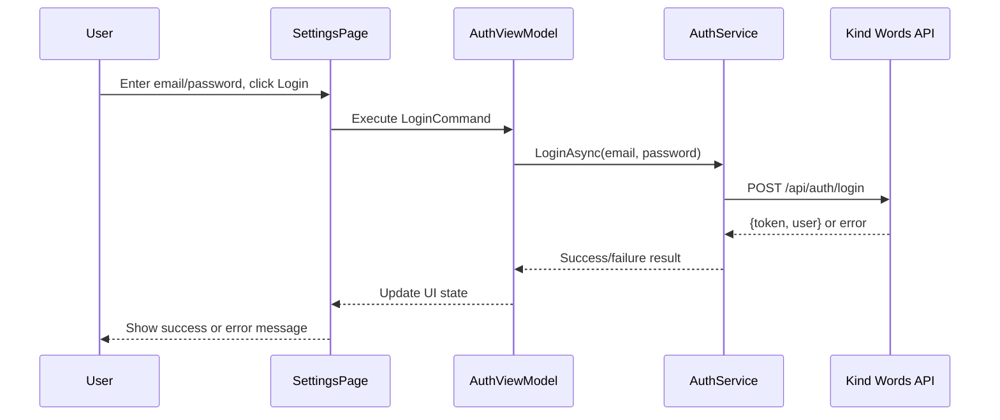
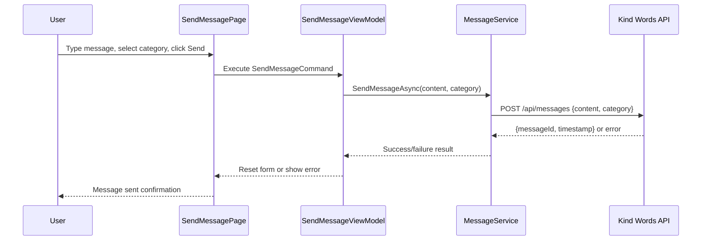
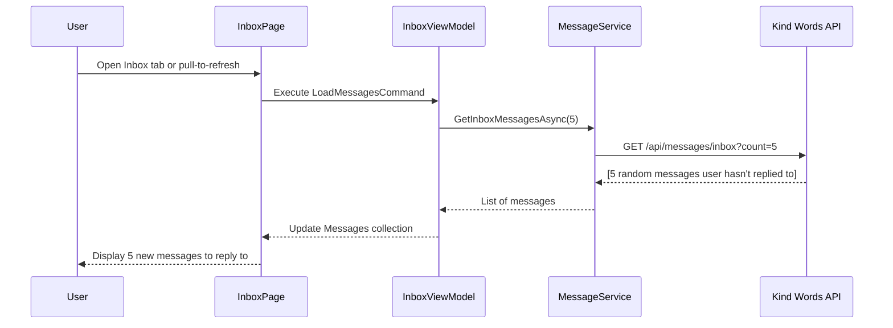

# 📚 Kind Words - Developer Guide

## 🎯 **Overview**

This guide explains **how Kind Words works** from a software developer's perspective - covering architecture, data flow, connections between components, and how to make changes efficiently.

---

## 🏗️ **Architecture Overview**

### **High-Level Architecture (School Requirement Compliant)**

```
┌─────────────────────┐    HTTPS/7001     ┌─────────────────────┐    EF Core    ┌─────────────────────┐
│   Kind Words MAUI   │◄──────────────────►│  Kind Words API     │◄─────────────►│   SQL Server DB     │
│   (.NET 8)          │    JWT Bearer      │  (.NET 9)           │   Migrations  │   (LocalDB)         │
│                     │                    │                     │               │                     │
│ ┌─────────────────┐ │                    │ ┌─────────────────┐ │               │ ┌─────────────────┐ │
│ │  ViewModels     │ │                    │ │  Controllers    │ │               │ │  Users Table    │ │
│ │  (MVVM)         │ │                    │ │  (REST API)     │ │               │ │  Messages Table │ │
│ └─────────────────┘ │                    │ └─────────────────┘ │               │ │  Replies Table  │ │
│ ┌─────────────────┐ │                    │ ┌─────────────────┐ │               │ │  MessageReplies │ │
│ │  Services       │ │                    │ │  EF DbContext   │ │               │ └─────────────────┘ │
│ │  (HTTP calls)   │ │                    │ │  (Database)     │ │               └─────────────────────┘
│ └─────────────────┘ │                    │ └─────────────────┘ │
│ ┌─────────────────┐ │                    │ ┌─────────────────┐ │
│ │  Views (XAML)   │ │                    │ │  Models/DTOs    │ │
│ └─────────────────┘ │                    │ └─────────────────┘ │
└─────────────────────┘                    └─────────────────────┘
```

**✅ School Requirement Compliance:** _"De applicatie spreekt deze database nooit rechtstreeks aan. De transacties verlopen steeds via de REST service"_

### **Technology Stack**

- **Frontend**: .NET MAUI 8.0 (Cross-platform: Android, Windows)
- **Backend**: ASP.NET Core Web API (.NET 9)
- **Database**: SQL Server with Entity Framework Core 8.0
- **Architecture**: MVVM (Frontend) + REST API (Backend) + EF Core (Database)
- **Communication**: HTTPS/JSON via HttpClient with JWT Bearer tokens
- **Authentication**: JWT implementation with proper token validation
- **UI Framework**: Native MAUI + CommunityToolkit.Mvvm
- **Data Persistence**: SQL Server LocalDB with auto-migrations and seeding

---

## 📱 **MAUI App Architecture (Frontend)**

### **MVVM Pattern Implementation**

```
📁 Affirm8/
├── 📁 Models/               # Data structures
│   ├── User.cs             # User model + auth DTOs
│   ├── Message.cs          # Message model with business logic
│   ├── Reply.cs            # Reply model
│   └── UserStatistics.cs  # User statistics model
├── 📁 ViewModels/          # MVVM ViewModels (CommunityToolkit)
│   ├── AuthenticationViewModel.cs    # Login/Register logic
│   ├── SendMessageViewModel.cs       # Message sending logic
│   ├── InboxViewModel.cs             # Inbox + reply logic
│   ├── MyMessagesViewModel.cs        # User's messages + replies
│   ├── ProfileViewModel.cs           # User statistics
│   └── SettingsViewModel.cs          # Settings & preferences
├── 📁 Views/               # XAML Pages + Code-behind
│   ├── SendMessagePage.xaml         # Send affirmations
│   ├── InboxPage.xaml               # Browse & reply to messages
│   ├── MyMessagesPage.xaml          # User's own messages
│   ├── ProfilePage.xaml             # User statistics
│   ├── SettingsPage.xaml            # Login/preferences
│   ├── LoginPage.xaml               # Dedicated login screen
│   └── SplashPage.xaml              # App startup screen
├── 📁 Services/            # Business services
│   ├── AuthenticationService.cs     # JWT token management + API auth
│   ├── MessageService.cs            # REST API message operations
│   ├── LocalizationService.cs       # Language switching
│   └── ThemeService.cs              # Dark/light mode
└── 📁 Converters/          # XAML value converters (7 total)
    ├── BoolToSendButtonTextConverter.cs
    ├── BoolToHeartConverter.cs
    ├── BoolToLikeColorConverter.cs
    ├── InverseBoolConverter.cs
    ├── IsNotNullConverter.cs
    ├── IsNotZeroConverter.cs
    └── PasswordVisibilityConverter.cs
```

### **Data Flow in MAUI App**

1. **User Interaction** → XAML View (Button click, text input)
2. **Data Binding** → ViewModel Command/Property
3. **Business Logic** → ViewModel processes data
4. **Service Call** → ViewModel calls Service (AuthenticationService, MessageService)
5. **HTTP Request** → Service calls API via HttpClient with JWT Bearer token
6. **Database Update** → API uses Entity Framework to persist to SQL Server
7. **Response** → API returns data via JSON
8. **Update UI** → ViewModel updates ObservableProperties
9. **UI Refresh** → XAML automatically updates via data binding

**Example Flow - Sending a Message:**

```
SendMessagePage.xaml (Button)
→ SendMessageViewModel.SendMessageCommand
→ MessageService.SendMessageAsync()
→ HTTP POST to API with JWT Bearer token
→ API saves to SQL Server via Entity Framework
→ API returns success/error response
→ Update ViewModel properties
→ UI refreshes automatically
```

---

## 🔧 **API Architecture (Backend)**

### **API Project Structure**

```
📁 KindWordsApi/KindWordsApi/
├── 📁 Controllers/         # REST API endpoints
│   ├── AuthController.cs          # POST /api/auth/login, /register
│   └── MessagesController.cs      # Complete message CRUD operations
├── 📁 Data/               # Entity Framework
│   └── ApplicationDbContext.cs    # EF DbContext with DbSets
├── 📁 Models/              # Entity models + DTOs
│   ├── User.cs            # User entity (EF model)
│   ├── Message.cs         # Message entity with navigation properties
│   ├── Reply.cs           # Reply entity
│   ├── MessageReply.cs    # Junction table for tracking replies
│   └── DTOs.cs            # All API request/response DTOs
├── 📁 Services/           # Business logic services
│   ├── JwtService.cs             # JWT token generation/validation
│   └── DatabaseSeeder.cs         # Auto-seeding sample data
├── 📁 Migrations/         # Entity Framework migrations
│   ├── [timestamp]_InitialCreate.cs    # Auto-generated
│   └── ApplicationDbContextModelSnapshot.cs
├── Program.cs             # API + EF + JWT configuration
├── appsettings.json       # JWT + Connection String configuration
└── Properties/
    └── launchSettings.json       # Port configuration (7001)
```

### **API Endpoints Design**

| **Method** | **Endpoint**                                 | **Purpose**                       | **Auth Required** |
| ---------- | -------------------------------------------- | --------------------------------- | ----------------- |
| `POST`     | `/api/auth/register`                         | User registration                 | ❌ No             |
| `POST`     | `/api/auth/login`                            | User login                        | ❌ No             |
| `GET`      | `/api/messages/inbox?count=5`                | Get random messages to reply to   | ✅ Yes            |
| `GET`      | `/api/messages/my-messages`                  | Get user's own messages + replies | ✅ Yes            |
| `POST`     | `/api/messages`                              | Send new message                  | ✅ Yes            |
| `POST`     | `/api/messages/{id}/reply`                   | Reply to specific message         | ✅ Yes            |
| `GET`      | `/api/messages/search?term=...&category=...` | Search inbox messages             | ✅ Yes            |
| `GET`      | `/api/messages/{id}`                         | Get specific message details      | ✅ Yes            |

### **🗄️ Database Schema**

```sql
Users (Id GUID, Email, NickName, PasswordHash, JoinedAt)
├── Messages (Id INT, Content, Category, UserId, CreatedAt, IsAnonymous, ReplyCount, HasBeenRepliedTo)
│   └── Replies (Id INT, MessageId, Content, UserId, CreatedAt, IsAnonymous)
└── MessageReplies (Id INT, MessageId, UserId, RepliedAt) -- Junction table for tracking
```

### **🌱 Auto-Seeded Test Data**

- **3 Users**: alice@kindwords.com, bob@kindwords.com, charlie@kindwords.com (password: `password123`)
- **8 Messages**: Across all categories with realistic content
- **6 Replies**: Demonstrating conversation flows
- **MessageReply Tracking**: Who replied to what (for inbox filtering)

---

## 🔄 **Communication Flow**

### **Authentication Flow**



### **Message Sending Flow**



### **Inbox Loading Flow**



---

## 🔧 **How to Make Changes**

### **Adding a New API Endpoint**

1. **Define the DTO** in `Models/DTOs/`
2. **Add Controller Method** in appropriate controller
3. **Update Service** in `KindWordsDataService.cs` for business logic
4. **Test with Swagger** at `https://localhost:7001/swagger`

**Example - Add "Like Message" functionality:**

```csharp
// 1. Add DTO
public class LikeMessageRequest { public int MessageId { get; set; } }

// 2. Add Controller Method
[HttpPost("like")]
public async Task<IActionResult> LikeMessage([FromBody] LikeMessageRequest request)
{
    var userId = GetCurrentUserId();
    var result = _dataService.LikeMessage(userId.Value, request.MessageId);
    return Ok(result);
}

// 3. Update Service
public bool LikeMessage(Guid userId, int messageId)
{
    // Implementation here
}
```

### **Adding a New MAUI Screen**

1. **Create XAML Page** in `Views/`
2. **Create ViewModel** in `ViewModels/`
3. **Register in DI** in `MauiProgram.cs`
4. **Add to Navigation** in `AppShell.xaml`

**Example - Add "Statistics" page:**

```csharp
// 1. Create StatisticsPage.xaml + StatisticsPage.xaml.cs
// 2. Create StatisticsViewModel.cs with [ObservableObject]
// 3. In MauiProgram.cs:
builder.Services.AddTransient<StatisticsViewModel>();
builder.Services.AddTransient<StatisticsPage>();

// 4. In AppShell.xaml:
<ShellContent Title="Stats" ContentTemplate="{DataTemplate views:StatisticsPage}" />
```

### **Modifying Business Logic**

**Inbox Logic** (Random 5 messages user hasn't replied to):

- **File**: `MessageService.cs` → `GetInboxMessagesAsync()`
- **API**: `MessagesController.cs` → `GetInboxMessages()`

**Authentication Logic**:

- **MAUI**: `AuthenticationService.cs` → `LoginAsync()`, `RegisterAsync()`
- **API**: `AuthController.cs` → `Login()`, `Register()`

**My Messages Logic** (User's messages + all replies):

- **MAUI**: `MyMessagesViewModel.cs` → `LoadMyMessagesAsync()`
- **API**: `MessagesController.cs` → `GetMyMessages()`

### **Changing UI Appearance**

**Colors/Themes**: Modify in `App.xaml` resource dictionaries
**Page Layout**: Edit the specific `.xaml` file in `Views/`
**Data Display**: Modify `DataTemplate` sections in XAML
**Converters**: Add/modify in `Converters/` for custom data transformations

---

## 🔌 **Configuration & Connections**

### **API Connection Configuration**

- **MAUI Side**: `AuthenticationService.cs` → `BaseUrl = "https://localhost:7001/api"`
- **API Side**: `launchSettings.json` → `"applicationUrl": "https://localhost:7001;http://localhost:5001"`

### **Dependency Injection Setup**

**MAUI** (`MauiProgram.cs`):

```csharp
builder.Services.AddSingleton<AuthenticationService>();
builder.Services.AddSingleton<MessageService>();
builder.Services.AddTransient<SendMessageViewModel>();
// etc.
```

**API** (`Program.cs`):

```csharp
builder.Services.AddSingleton<KindWordsDataService>();
builder.Services.AddSingleton<JwtService>();
builder.Services.AddAuthentication(JwtBearerDefaults.AuthenticationScheme)
// etc.
```

### **Multi-Project Startup**

- **Visual Studio**: `KindWords-FullStack.sln` with multiple startup projects
- **Scripts**: `start-kindwords-fullstack.bat` starts API first, then MAUI
- **Manual**: Start API (`dotnet run` in API dir), then MAUI app

---

## 🐛 **Common Development Tasks**

### **Testing API Endpoints**

1. Start API: `cd KindWordsApi/KindWordsApi && dotnet run`
2. Open Swagger: `https://localhost:7001/swagger`
3. Test endpoints directly in browser

### **Debugging MAUI App**

1. Set breakpoints in ViewModels or Services
2. Use Visual Studio debugger with F5
3. Check Output window for HTTP request/response logs

### **Adding Sample Data**

- **API**: Modify `KindWordsDataService.cs` → `SeedSampleData()`
- **MAUI**: Modify `MessageService.cs` → `SeedSampleData()` (if using mock data)

### **Changing Business Rules**

**Inbox Selection Logic**:

```csharp
// In KindWordsDataService.cs
var availableMessages = _messages.Values
    .Where(m => m.UserId != currentUserId && !userReplies.Contains(m.Id))
    .OrderBy(_ => Guid.NewGuid()) // Random order
    .Take(count);
```

**My Messages Logic**:

```csharp
// In KindWordsDataService.cs
var userMessages = _messages.Values
    .Where(m => m.UserId == userId)
    .OrderByDescending(m => m.CreatedAt);
```

---

## 📊 **Data Models Explained**

### **Core Models**

**User Model**:

- `Id` (Guid): Unique identifier matching API
- `Email`: Authentication credential
- `NickName`: Display name
- `Token`: JWT token for API calls
- `IsAuthenticated`: Computed property

**Message Model**:

- `Id` (int): Message identifier
- `Content`: The affirmation text
- `Category`: Support/Hope/Celebration/Gratitude
- `UserId`: Creator of the message
- `RepliedByUserIds`: List of users who replied (for inbox filtering)
- `AllReplies`: All replies (visible only to message creator)

**Reply Model**:

- `Id` (int): Reply identifier
- `MessageId`: Parent message reference
- `Content`: Reply text
- `UserId`: Who sent the reply

---

## 🚀 **Deployment & Production**

### **Current Status**

- ✅ **Development Environment**: Fully configured with Visual Studio F5
- ✅ **Authentication**: Registration and login working end-to-end
- ✅ **API-MAUI Communication**: HTTPS working with JWT tokens
- ⚠️ **Data Storage**: In-memory only (data lost on restart)
- 🔧 **Production**: Ready for database integration and hosting

### **Database Architecture**

**Current Setup (Development):**

```csharp
// In KindWordsApi/Services/DataService.cs
private readonly ConcurrentDictionary<Guid, User> _users = new();
```

- **Storage**: In-memory `ConcurrentDictionary`
- **Persistence**: None (data lost on restart)
- **Connection String**: Not applicable
- **Location**: `KindWordsApi/Services/DataService.cs`

**Production Migration Plan:**

1. **Add Entity Framework** to `KindWordsApi.csproj`
2. **Create DbContext** with User, Message, Reply entities
3. **Add Connection String** to `appsettings.json`
4. **Replace DataService** with EF repository pattern
5. **Add Migrations** for database schema

### **Next Steps for Production**

1. **Database**: Replace in-memory storage with Entity Framework + SQL
2. **Message Endpoints**: Implement send/inbox/replies API
3. **Hosting**: Deploy API to Azure/AWS
4. **MAUI Deployment**: Package for Android/Windows stores
5. **Security**: Production JWT secrets, HTTPS certificates

---

## 📋 **Quick Reference**

### **Start Development**

```bash
# Option 1: Visual Studio (Recommended)
# Open Affirm8.sln, set multiple startup projects, press F5

# Option 2: Manual
cd KindWordsApi/KindWordsApi && dotnet run &
cd Affirm8 && dotnet run --framework net8.0-windows10.0.19041.0
```

### **Key Files to Remember**

- **Solution**: `Affirm8.sln` (main solution file)
- **API Config**: `KindWordsApi/KindWordsApi/Program.cs`
- **MAUI Config**: `Affirm8/MauiProgram.cs`
- **API URL**: `Affirm8/Services/AuthenticationService.cs`
- **Database**: Auto-created at `(localdb)\mssqllocaldb`

### **Common URLs**

- **API**: `https://localhost:7001`
- **Swagger**: `https://localhost:7001/swagger`
- **Test Endpoint**: `https://localhost:7001/weatherforecast`

---

**This guide should give you everything you need to understand, modify, and extend the Kind Words application efficiently!** 🚀
